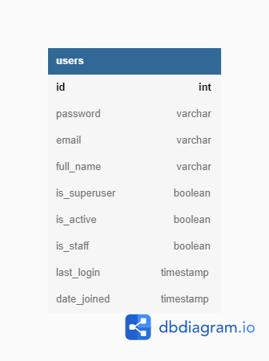

# AI4Bharat SE Internship Task
* The <code>[Heroku Deploy](https://translate-ai4bharat.herokuapp.com/)</code> of the website. Login Credentials :
  * Username - <code>testuser</code>
  * Password - <code>testuser</code>
* Or you can sign up easily on the website itself.
* Please try to use <code>United States VPN</code> while using the website as the website is too slow. Or surf it locally.
* I've pushed the sqlite3 file with it with the same login credentials.
* The [▶️ Video Tutorial](https://www.youtube.com/watch?v=DZBwttD9NrI) of the website.
# Structure
## Frontend
* The Website has 5 main pages.
  * Home
  * Login
  * Sign Up
  * Translate
  * Project

#### Home Page

#### Login Page

#### Sign Up Page

#### Translate Page

#### Projects Page

## Backend
* There are 2 apps in this django-project.
  * <code>authentication</code>
  * <code>main</code>
* The models of these apps are as follows:

#### Authentication

#### Main

